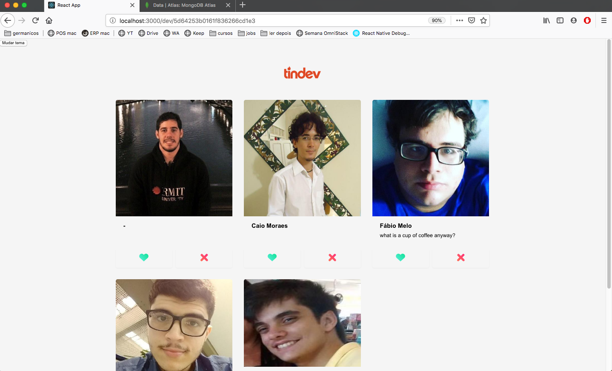

# Tindev

## Sobre

- TODO: _________

## Prints




# Features Implementadas

- TODO: _____

## Front e Back

- Instalar Node

```sh
sudo apt-get install -y curl
```

```sh
sudo curl -sL https://deb.nodesource.com/setup_8.x |sudo -E bash
```

```sh
sudo apt-get install -y nodejs
```

- instalar yarn

[instalação do yarn](https://yarnpkg.com/pt-BR/docs/install#debian-stable)


- OBS: se você, como eu veio do NPM, taí um [link](https://yarnpkg.com/lang/pt-br/docs/migrating-from-npm/) para ajudar na transição


## BackEnd

- Basta ir para o diretório do backend
```sh
cd backend
```

e instalar as dependências
```sh
yarn install
```

e depois é só colocar o servidor para "ouvir" as requisições
```sh
node src/index.js
```


## FrontEnd

- [react](https://reactjs.org/docs/getting-started.html)

- Basta ir para o diretório do frontend
```sh
cd frontend
```

e instalar as dependências
```sh
yarn install
```

Rodar no browser
```sh
yarn start
```

## Mobile

Instalar as dependencias

```sh
cd mobile
yarn install
```

Primeira instalacao (precisa do celular conectado via USB)

```sh
react-native run-android

ou

react-native run-ios
```


